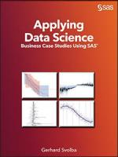

# Applying Data Science - Business Case Studies using SAS

Applying Data Science Methods to Real Life Business Use Cases. Companion and Download Site for the [SAS Press Book](https://www.sas.com/store/books/categories/usage-and-reference/applying-data-science-business-case-studies-using-sas-/prodBK_63165_en.html?storeCode=SAS_US)  "Applying Data Science - Business Case Studies using SAS" by Gerhard Svolba. [--> amazon.com](https://www.amazon.com/Applying-Data-Science-Business-Studies-ebook/dp/B06Y5QY872/ref=sr_1_1?qid=1550842820)

* Presentations of all case studies (and more) have also been recorded in my Data Science Webinar on [Youtube](https://www.youtube.com/playlist?list=PLdMxv2SumIKs0A2cQLeXg1xb9OVE8e2Yq).
* Contributions at SAS Communities on content from this book

[Encoding of CLASS Variables in Regression Analysis - Better understand the ORDINAL encoding](https://communities.sas.com/t5/SAS-Communities-Library/Encoding-of-CLASS-Variables-in-Regression-Analysis-Better/ta-p/632923)

[Display the hidden estimate for the reference category in EFFECT coding for better interpretability](https://communities.sas.com/t5/SAS-Communities-Library/Display-the-hidden-estimate-for-the-reference-category-in-EFFECT/ta-p/633865)

[%CALC_REFERENCE_CATEGORY displays the "hidden" coefficient in EFFECT encoding for CLASS variables](https://communities.sas.com/t5/SAS-Communities-Library/CALC-REFERENCE-CATEGORY-displays-the-quot-hidden-quot/ta-p/633496)

[Simulate timeseries data with a SAS DATA Step and SAS Functions](https://communities.sas.com/t5/SAS-Communities-Library/Simulate-timeseries-data-with-a-SAS-DATA-Step-and-SAS-Functions/ta-p/633852)

[Automatically highlight data-driven events with reference lines in line-charts](https://communities.sas.com/t5/SAS-Communities-Library/Automatically-highlight-data-driven-events-with-reference-lines/ta-p/645944)

* [Getting More Insight into Your Forecast Errors with the GLMSELECT and
QUANTSELECT Procedures](https://www.sas.com/content/dam/SAS/support/en/sas-global-forum-proceedings/2018/1673-2018.pdf)
* [Other books](https://support.sas.com/en/books/authors/gerhard-svolba.html) from Gerhard Svolba at SAS Press.
* [Data Preparation for Data Science Using SAS](https://github.com/gerhard1050/Data-Preparation-for-Data-Science-Using-SAS)
* [Data Quality for Data Science Using SAS](https://github.com/gerhard1050/Data-Quality-for-Data-Science-Using-SAS)
* [Top 10 bestselling titles at SAS Global Forum 2018](https://blogs.sas.com/content/sastraining/2018/05/08/top-10-bestselling-titles-at-sas-global-forum-2018/)

## Overview
This is the new SAS Press book of Gerhard Svolba. It contains 8 case studies in 28 practical chapters with business explainations, methodological considerations and lots of SAS Code.

Why you want to read this book:
* This book reflects the author's enthusiasm to use analytical and data science methods to solve business questions and to implement the solution using SAS.
* It shows you the benefits of analytics, how to gain more insight into your data, and how to make better decisions. In eight entertaining and real-world case studies, Svolba combines data science and advanced analytics with business questions, illustrating them with data and SAS code.
* Written for business analysts, statisticians, data miners, data scientists, and SAS programmers, Applying Data Science bridges the gap between high-level, business-focused books that skimp on the details and technical books that only show SAS code with no business context.

This book is written for a variety of different persona groups and profiles.
* Business Analysts and Business Experts: Businesspeople can review the examples and see what can be achieved with analytical methods. They get insight into the power of analytics and the additional findings that can be generated by these methods. They might not study the SAS implementation and the code in much detail. They would rather hand over the implementation examples to their data scientist to give them a quick start to apply the methods.
* Statisticians, Data Miners, Data Scientists, and Quantitative Experts: This group of people might be interested to see how analytical methods can be applied to real-world business questions. They learn how analytical methods that are established in a certain industry might be applied to other areas. They see practical situations and constraints that they can expect to encounter when they apply data science methods.
* SAS Programmers: The book contains a lot of SAS code, including SAS macros, SAS DATA step code for data preparation, SAS analytics procedures, and SAS graph procedures. In this code SAS programmers can find new ways to solve certain problems in SAS and transfer the solutions in these examples to their day-to-day problems

- [Book Excerpt](https://www.sas.com/storefront/aux/en/spba/63165_excerpt.pdf)
- [Table of Contents](https://www.sas.com/storefront/aux/en/spba/63165_toc.pdf)

## Changes, Improvements and Typos in the printed version of the book
Please send any findings potential typos and necessary changes to the author. Email: sastools.by.gerhard@gmx.net

Note that the downloadable code files from github already contain these changes.

* Page 16 and 17: The PROC LIFETEST statement has the brackets around HAZARD and MAXTIME set in a wrong way.
Here is the correct version for both PROC LIFETEST calls in section 1.7.2 and 1.7.3

PROC LIFETEST DATA=employees plots=(hazard(bandwidth=3)) maxtime=120;

Thanks to __Nicole Fox__ for pointing this out!

* Page 54: The datastep at the beginning of chapter 3.5.2 should use variable _ _T_ _ instead of variable TIME. Here is the correct version.

data employees_expanded;

 set employees;
 
  do _ _T_ _ = 1 to duration;
  
  if TIME NE duration then Event = 0;
  
  else Event = Resigned;
  
  output;
  
 end;
 
run;

